### Notes from [Finding Bigfoot with JavaScript + vector search](https://youtu.be/KxuZEApLRPU)

> "to trench on certain matters which, on a superficial view, might seem foreign to the case, but actually were highly relevant.<br />--- The Stranger by Albert Camus"

[](https://youtu.be/b1P5CsG9wpo)


#### Prologue
Previously, there was [Redis Stack Workshop: Redis Stack OM Library for Node.js](https://youtu.be/KUfufrwpBkM). Everytime I look into codes written by Guy, I learn something new... This repo is a simplified version of the original and is in favor of [SaaS](https://en.wikipedia.org/wiki/Software_as_a_service) rather then [Docker](https://en.wikipedia.org/wiki/Docker_(software)) environment. 

- All you need is [NodeJS](https://nodejs.org/en) and a [Redis Free Account](https://redis.io/try-free/). 
- The original [README.md](./README.Guy.md) written by [Guy Royse](https://www.youtube.com/@guyroyse). 


#### I. Setting up backend end API 
To begin with, augment three files under `api` folder.  

.env
```
REDIS_HOST=r<your redis host>
REDIS_PORT=<your redis port>
REDIS_USERNAME=<your redis username>
REDIS_PASSWORD=<your redis password>
```

`src/config.js`
```
export const REDIS_HOST = process.env.REDIS_HOST ?? 'redis'
export const REDIS_PORT = Number(process.env.REDIS_PORT ?? 6379)
export const REDIS_USERNAME = process.env.REDIS_USERNAME ?? 'default'
export const REDIS_PASSWORD = process.env.REDIS_PASSWORD ?? ''
```

`src/redis.js`
```
async function connectToRedis() {
  const redis = createClient({ socket: { 
                                        host: REDIS_HOST, 
                                        port: REDIS_PORT 
                                       },
                                username: REDIS_USERNAME, 
                                password: REDIS_PASSWORD})
  redis.on('error', (err) => console.log('Redis Client Error', err))
  await redis.connect()
  return redis
}
```

Run `npm install` and `npm start`. 


Three API endpoints are available on `POST` request: 

```
http://localhost:3000/api/load
http://localhost:3000/api/fetch
http://localhost:3000/api/search 
```

- load : Call `save` function in `main.js` to add a sighting record to Redis by `hSet` and `xAdd` for later processing; 
- fetch : Call `fetch` function in `main.js` to get a sighting record from Redis by `hGetAll`; 
- search : Call `search` function in `main.js` to search sighting records via *vector semantic search*; 

Our backend is up and running, easy-peasy! Right? Behind the scene `redis.js` checks and create index `bigfoot:sighting:index` if necessary every time it is restarted. 

`src/redis.js`
```
async function createIndex() {
  await redis.ft.create(
    'bigfoot:sighting:index', {
      'id': SchemaFieldTypes.TAG,
      'title': SchemaFieldTypes.TEXT,
      'observed': SchemaFieldTypes.TEXT,
      'classification': SchemaFieldTypes.TAG,
      'county': SchemaFieldTypes.TAG,
      'state': SchemaFieldTypes.TAG,
      'latlng': SchemaFieldTypes.GEO,
      'highTemp': SchemaFieldTypes.NUMERIC,
      'embedding': {
        type: SchemaFieldTypes.VECTOR,
        ALGORITHM: VectorAlgorithms.FLAT,
        TYPE: 'FLOAT32',
        DIM: 384,
        DISTANCE_METRIC: 'L2'
      }
    }, {
      ON: 'HASH',
      PREFIX: `${BIGFOOT_PREFIX}:`
    }
  )
}
```

Which is equivalent to: 
```
FT.CREATE bigfoot:sighting:index 
  ON HASH PREFIX 1 bigfoot:sighting:
  SCHEMA
  id TAG 
  title TEXT 
  observed TEXT 
  classification TAG 
  county TAG 
  state TAG 
  latlng GEO 
  highTemp NUMERIC 
  embeddings VECTOR FLAT 6
    TYPE FLOAT32
    DIM 384
    DISTANCE_METRIC L2
```

To create index `bigfoot:sighting:index` on [HASH](https://redis.io/docs/latest/develop/data-types/hashes/) with prefix `bigfoot:sighting:`, our protagonist `embeddings` field to be indexed with FLAT method on array of 384 dimensions of FLOAT32, metric distance L2, so to speak...


#### II. Loading the data 
It is impossible to load all 4586 sightings into a Redis Free Account as it is confined to 30MB only! I significantly trimmed them down to 300 sightings. Each sighting data takes the form of: 

```
{
    "id": "8130",
    "timestamp": 1077753600,
    "title": "Tribal government employee photographs line of tracks in snow",
    "observed": "Foot prints where found in the bad lands of North Dakota near Mandaree.",
    "classification": "Class B",
    "county": "McKenzie",
    "state": "North Dakota",
    "latitude": 47.63297,
    "longitude": -102.7291,
    "latlng": "-102.7291,47.63297",
    "locationDetails": "The location was about 10 to 15 miles south of Mandaree ND.The landscape was the bad lands,steep clay hills,some brush and trees.",
    "dewPoint": 26.51,
    "humidity": 0.88,
    "cloudCover": 0.18,
    "moonPhase": 0.21,
    "pressure": 1010.4,
    "weatherSummary": "Partly cloudy starting in the evening.",
    "uvIndex": 2,
    "visibility": 7.19,
    "highTemp": 38.12,
    "midTemp": 35.03,
    "lowTemp": 31.94,
    "windBearing": 121,
    "windSpeed": 5.78
}
```

Leave the API running and open another terminal. Let's change to the `loader` folder and run `npm install` command. To show help with:
```
npm start -- --help
```

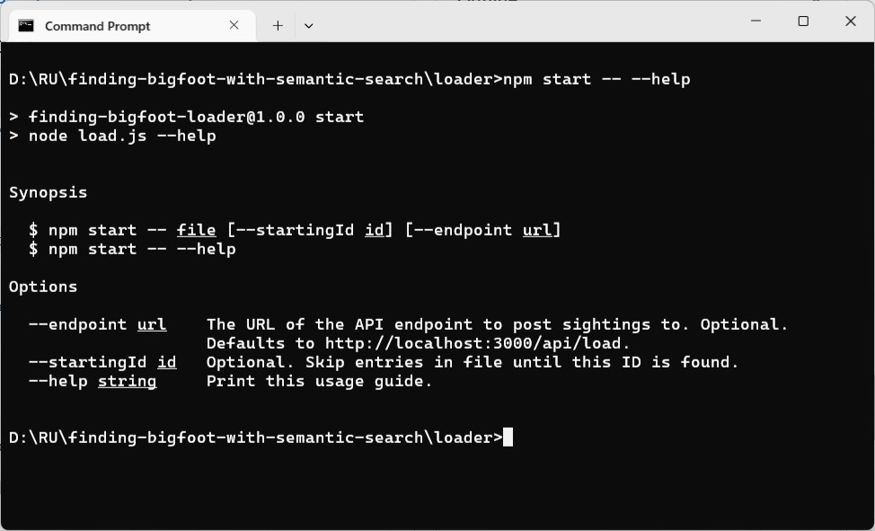

To load data with: 
```
npm start -- ../data/bfro_reports_geocoded_300.jsonl
```

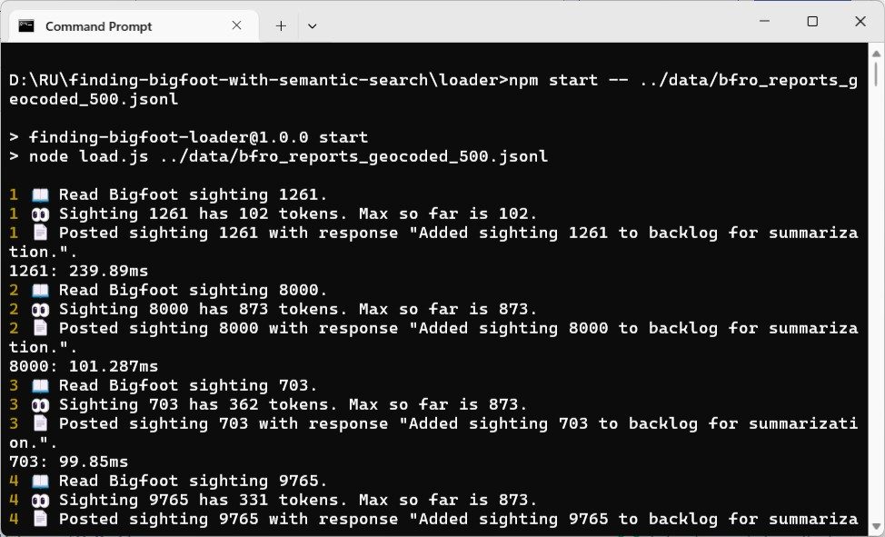

Check with [RedisInsight](https://redis.io/insight/): 

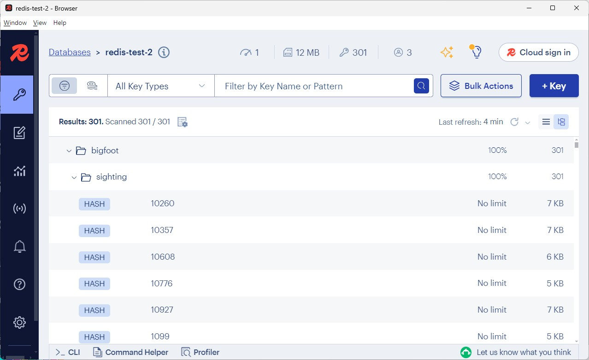

As you can see, every sighting is stored in [HASH](https://redis.io/docs/latest/develop/data-types/hashes/) `bigfoot:sighting:<id>`, a separate [STREAM](https://redis.io/docs/latest/develop/data-types/streams/) `bigfoot:sighting:reported` is stored for later use. The `loader.js` per se works by reading in [JSONL](https://jsonlines.org/) data line by line, makes a `POST` call to `http://localhost:3000/api/load`, our backend API, that is. 


#### III. Creating embeddings 
We have loaded sighting data, however, not until we create *vector embeddings*, do we bestow backend API searching capability. How we do that? Change to `embedder` folder and modify three files we we did before.  

.env
```
REDIS_HOST=r<your redis host>
REDIS_PORT=<your redis port>
REDIS_USERNAME=<your redis username>
REDIS_PASSWORD=<your redis password>
```

`src/config.js`
```
export const REDIS_HOST = process.env.REDIS_HOST ?? 'redis'
export const REDIS_PORT = Number(process.env.REDIS_PORT ?? 6379)
export const REDIS_USERNAME = process.env.REDIS_USERNAME ?? 'default'
export const REDIS_PASSWORD = process.env.REDIS_PASSWORD ?? ''
```

`src/redis.js`
```
async function connectToRedis() {
  const redis = createClient({ socket: { 
                                        host: REDIS_HOST, 
                                        port: REDIS_PORT 
                                       },
                                username: REDIS_USERNAME, 
                                password: REDIS_PASSWORD})
  redis.on('error', (err) => console.log('Redis Client Error', err))
  await redis.connect()
  return redis
}
```

Run `npm install`. The embedder is a stand-alone process which reads in sighting from stream and do three things: 

- To summarize the content in `observed` into a new `summary` field using model 
[Mistral-7B-Instruct-v0.2-GGUF](https://huggingface.co/TheBloke/Mistral-7B-Instruct-v0.2-GGUF/blob/main/mistral-7b-instruct-v0.2.Q4_K_M.gguf); 

- To create `embedding` field from `summary` using [Xenova/all-MiniLM-L6-v2](https://huggingface.co/Xenova/all-MiniLM-L6-v2);

- Add these two new field into original sighting data via `hSet`. 

`app.js`
```
async function processEvent(event) {

  // get the message contents
  const sightingId = event.message.id
  const sightingText = event.message.observed

  // summarize and embed the sighting
  const sightingSummary = await summarize(sightingText) // this can take a while
  const embeddingBytes = await embed(sightingSummary)

  // update Hash in Redis with the summary and embedding
  const key = `bigfoot:sighting:${sightingId}`
  await redis.hSet(key, { summary: sightingSummary, embedding: embeddingBytes })

}
```

`embed.js`
```
export async function summarize(text) {
  try {
    return await tryToSummarize(fetchSummarizationModel(), text)
  } catch (error) {
    console.log("Error using model. Recreating model and retrying.", error)
    return await tryToSummarize(fetchSummarizationModel(true), text)
  }
}

export async function embed(text) {
  const embedding = await fetchEmbeddingModel().embedQuery(text)
  const embeddingBytes = Buffer.from(Float32Array.from(embedding).buffer)
  return embeddingBytes
}
```

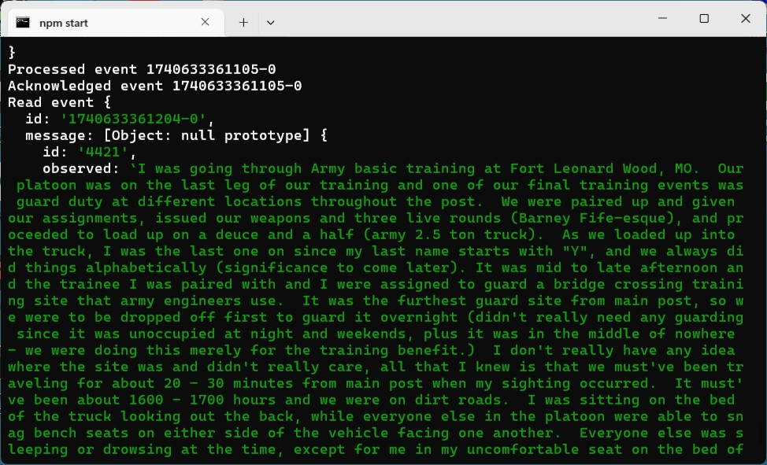

One point worth noting in embedder is the use of **consumer group** `bigfoot:sighting:group`to process the sighting stream. 

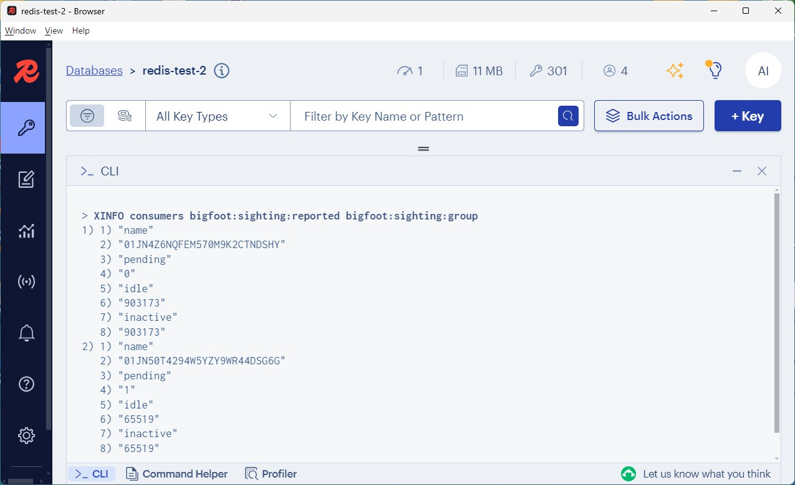

`app.js`
```
// loop forever to read from stream
while (true) {

  try {

    // try to claim an old event first
    let event = await claimPendingEvent(streamKey, consumerGroupName, consumerName)
    if (event) console.log("Claimed pending event", event)

    // read next event from the stream if nothing was claimed
    if (event === null) {
      event = await readNextEvent(streamKey, consumerGroupName, consumerName)
      if (event) console.log("Read event", event)
    }

    // loop if nothing new was found
    if (event === null) {
      console.log("No event received, looping.")
      continue
    }

    // process the event
    await processEvent(event)
    console.log("Processed event", event.id)

    // acknowledge that the event was processed
    await acknowledgeEvent(streamKey, consumerGroupName, event)
    console.log("Acknowledged event", event.id)

  } catch (error) {
    console.log("Error reading from stream", error)
  }
}
```

Typically `app.js` is looping endless and do four things: 

- Reclaim unprocessed sighting, if any; 

- If there is no unprocessed sighting, read next sighting, if any; 

- To process the sighting 

- To acknowledge that the sighting was processed

In this way, multiple copies of embedder can be orchestrated to speed up the process. Redis consumer group is a power mechanism to ensure at-least-once semantic, in this way, consumer group didn't make me disappointed as the embedding procss DOES crash from time to time... 

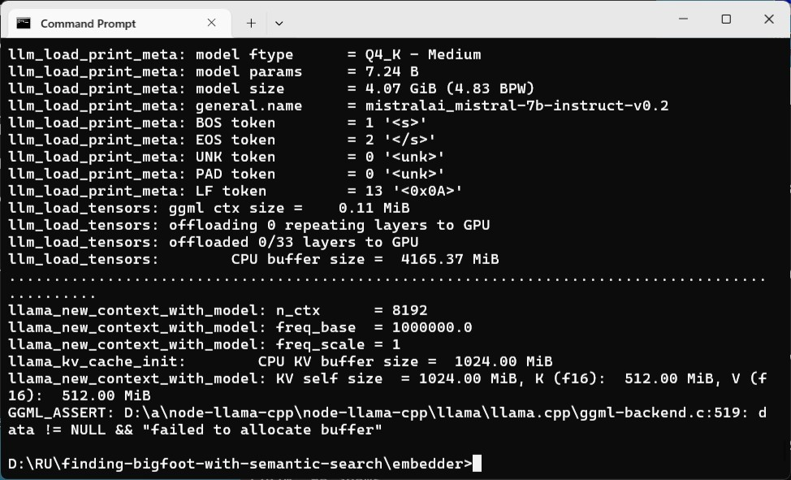

In this case, you just need to re-run the embedder...

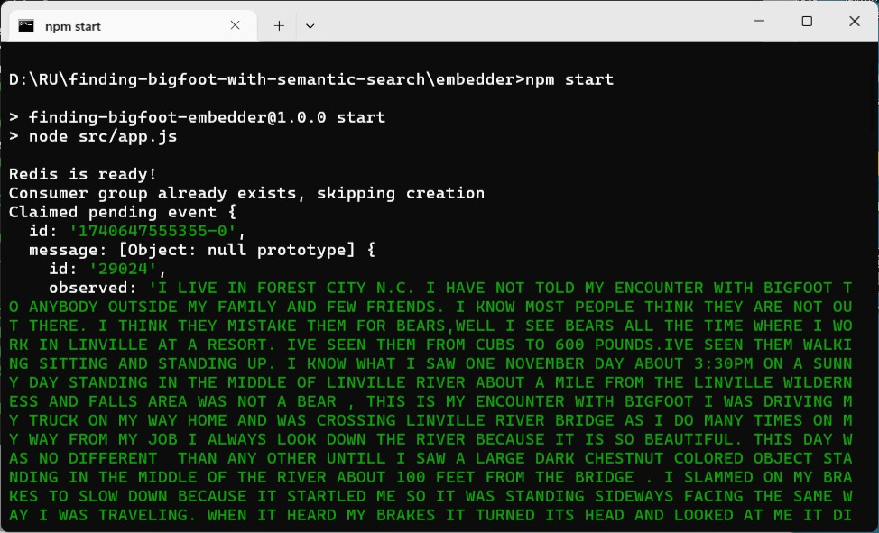

Creation of embeddings is a CPU intensive task, it takes 3 minutes to process one sighting in my Windows 11, 32G, i7 machine. 

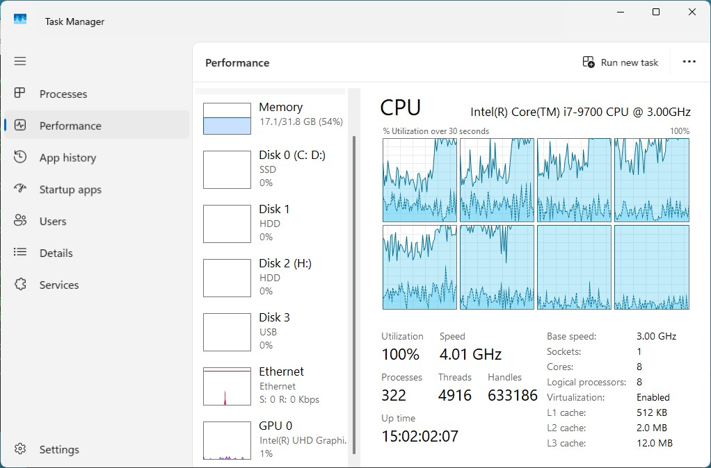


#### IV. Running the front end
Up till now, we've got everything ready to run the frontend. Just change to `web` folder and type `npm install` and `npm run dev`. 

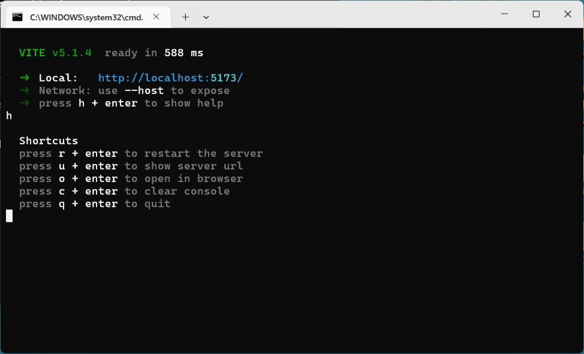

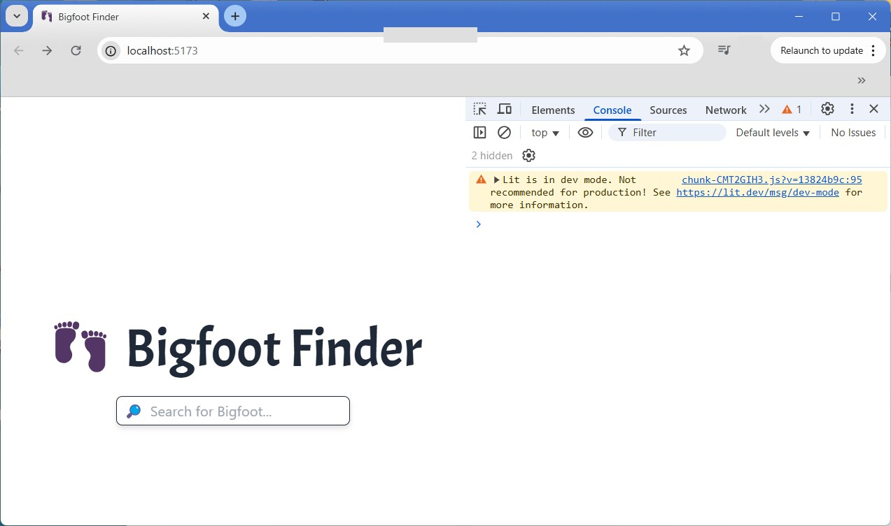

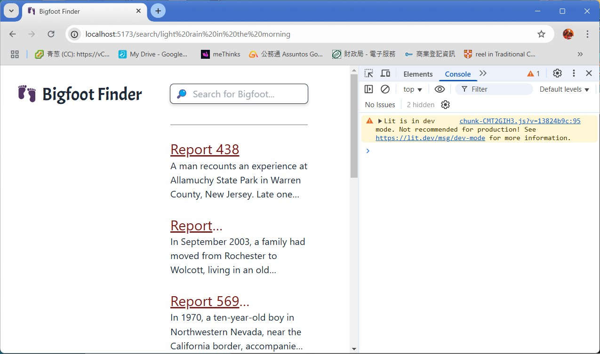

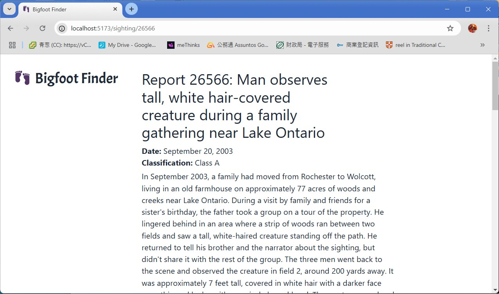

Va là! It works as expected... But *HOW*?

> Redis introduced vector search capabilities in Redis 7.2, which was released in October 2023. This release included support for indexing and querying vector fields, allowing users to perform semantic searches and leverage vector embeddings in various applications.

Redis supports three types of query on [vectors](https://redis.io/docs/latest/develop/interact/search-and-query/advanced-concepts/vectors/): 

- KNN vector search: Search finds the top k nearest neighbors to a query vector; 

- Vector range search: Vector range queries allow you to filter the index using a radius parameter representing the semantic distance between an input query vector and indexed vector fields; 

- Hybrid search: Redis supports vector searches that include filters to narrow the search space based on defined criteria. If your index contains searchable fields (for example, TEXT, TAG, NUMERIC, GEO, GEOSHAPE, and VECTOR).

Let's back to our backend API code: 

`main.js`
```
export async function search(query, params, count) {

  // build a search query portion of the redis query based on the parameters
  let searchQuery = ''
  if (params.state) searchQuery += `@state:{${params.state}} `
  if (params.county) searchQuery += `@county:{${params.county}} `
  if (params.classification) searchQuery += `@classification:{${params.classification}} `
  if (params.highTemp) searchQuery += `@highTemp:[${params.highTemp[0]} ${params.highTemp[1]}] `
  if (params.point) searchQuery += `@latlng:[${params.point.lng} ${params.point.lat} ${params.point.radius} mi] `

  // if the search query portion is empty, default it to a wildcard
  if (searchQuery.length === 0) searchQuery = "*"

  // build the vector query portion of the redis query
  const vectorQuery = `KNN ${count} @embedding $BLOB`

  // put it all together in the format (*)=>[KNN 1 @embedding $BLOB]
  const redisQuery = `(${searchQuery})=>[${vectorQuery}]`

  // embed the query string entered by the user
  const embedding = await fetchEmbeddingModel().embedQuery(query)
  const embeddingBytes = Buffer.from(Float32Array.from(embedding).buffer)

  // execute the search
  const searchResults = await redis.ft.search('bigfoot:sighting:index', redisQuery, {
    DIALECT: 2,
    PARAMS: { 'BLOB': embeddingBytes },
    SORTBY: '__embedding_score',
    RETURN: [ 'id', 'title', 'summary', '__embedding_score' ]
  })

  // parse and return the results
  const results =  searchResults.documents.map(document => document.value)
  return results

}
```

The `search` function does all the heavy lifting: 

- It composes `searchQuery` filter by concatenating conditions (`state`, `county`, `classification`, `highTemp`, `point`) present in `params`; 
- If the filter is empty, make it be '*'; 
- `vectorQuery` is a hybrid query with `searchQuery` as filter follows by KNN vector search; 
- Input `query` must be transformed to vector and converted to Array of float32; 
- Makes a call to [FT.SEARCH](https://redis.io/docs/latest/commands/ft.search/). 


#### V. Summary
To finish with creation of 300 embeddings, I can hear my computer kept on buzzing in exasperation for more than 15 hours... As you can see these AI things always mean money! 


#### VI. Bibliography
1. [Live coding with Guy: Finding Bigfoot with JavaScript + Vector Search, 2024年1月18日](https://youtu.be/R1IXYnoSd5U)
2. [Live coding with Guy: Finding Bigfoot with JavaScript + Vector Search, 12024年1月20日](https://youtu.be/NDAzTvjpyS4)
3. [Live coding with Guy: Finding Bigfoot with JavaScript + Vector Search, 2024年1月25日](https://youtu.be/jcn14w4eK_k)
4. [Live coding with Guy: Finding Bigfoot with JavaScript + Vector Search, 2024年2月8日](https://youtu.be/KxuZEApLRPU)
5. [Live coding with Guy: Finding Bigfoot with JavaScript + Vector Search, 2024年2月10日](https://youtu.be/0QIOxI7dE1Q)
6. [Finding Bigfoot with JavaScript + vector search](https://github.com/redis-developer/finding-bigfoot-with-semantic-search/tree/main?tab=readme-ov-file#start-services)
7. [Hugging Face](https://huggingface.co/TheBloke/Mistral-7B-Instruct-v0.2-GGUF/blob/main/mistral-7b-instruct-v0.2.Q4_K_M.gguf)
8. [Transformers.js](https://github.com/huggingface/transformers.js?tab=readme-ov-file#readme)
9. [Node-Redis](https://www.npmjs.com/package/redis)
10. [The Stranger by Albert Camus](https://www.macobo.com/essays/epdf/CAMUS,%20Albert%20-%20The%20Stranger.pdf)


#### Epilogue
For now, let's play with the index. 

Example 1: How many sightings? 
```
> FT.SEARCH bigfoot:sighting:index * LIMIT 0 0
1) "300"
```

Or
```
> FT.AGGREGATE bigfoot:sighting:index * GROUPBY 0 REDUCE COUNT 0 AS cnt
1) "1"
2) 1) "cnt"
   2) "300"
```

Example 2: How many states involved? 
```
> FT.AGGREGATE bigfoot:sighting:index * GROUPBY 1 @state SORTBY 2 @state ASC
1) "16"
2) 1) "state"
   2) "Alaska"
3) 1) "state"
   2) "Mississippi"
4) 1) "state"
   2) "Missouri"
5) 1) "state"
   2) "Montana"
6) 1) "state"
   2) "Nebraska"
7) 1) "state"
   2) "Nevada"
8) 1) "state"
   2) "New Hampshire"
9) 1) "state"
   2) "New Jersey"
10) 1) "state"
   2) "New Mexico"
11) 1) "state"
   2) "New York"
```

Example 3: How many states involved and sorted them in descending order? 
```
> FT.AGGREGATE bigfoot:sighting:index * GROUPBY 1 @state REDUCE COUNT 0 AS count SORTBY 2 @count DESC
1) "16"
2) 1) "state"
   2) "Missouri"
   3) "count"
   4) "130"
3) 1) "state"
   2) "North Carolina"
   3) "count"
   4) "75"
4) 1) "state"
   2) "Montana"
   3) "count"
   4) "43"
5) 1) "state"
   2) "Mississippi"
   3) "count"
   4) "21"
6) 1) "state"
   2) "Ohio"
   3) "count"
   4) "6"
7) 1) "state"
   2) "New Jersey"
   3) "count"
   4) "5"
8) 1) "state"
   2) "New Mexico"
   3) "count"
   4) "4"
9) 1) "state"
   2) "North Dakota"
   3) "count"
   4) "4"
10) 1) "state"
   2) "Nevada"
   3) "count"
   4) "3"
11) 1) "state"
   2) "Pennsylvania"
   3) "count"
   4) "2"
```

Example 4: Top 10 most detailed sighting report?
```
> FT.AGGREGATE bigfoot:sighting:index * LOAD 1 @observed FILTER "exists(@observed)" apply "strlen(@observed)" AS obs_len GROUPBY 2 @id @obs_len SORTBY 2 @obs_len DESC LIMIT 0 10
1) "299"
2) 1) "id"
   2) "46475"
   3) "obs_len"
   4) "14228"
3) 1) "id"
   2) "5697"
   3) "obs_len"
   4) "14198"
4) 1) "id"
   2) "5770"
   3) "obs_len"
   4) "13529"
. . .    
```

Example 5: Sightings in 149.4937, 64.200 and 5700km around. 
```
> FT.SEARCH bigfoot:sighting:index "*" GEOFILTER latlng 149.4937 64.200 5700 km return 1 title SORTBY title
1) "6"
2) "bigfoot:sighting:36759"
3) 1) "title"
   2) "Deer hunter on the Flathead Indian Reservation passes a tall biped on the roadside"
4) "bigfoot:sighting:10260"
5) 1) "title"
   2) "Four climbers report repeated vocalizations"
6) "bigfoot:sighting:1517"
7) 1) "title"
   2) "Horse-riding witnesses see hairy bipedal animal cross trail on Blackfeet Reservation"
8) "bigfoot:sighting:21907"
9) 1) "title"
   2) "Possible sighting and wood knocks heard near Swan Lake"
10) "bigfoot:sighting:12636"
11) 1) "title"
   2) "Video taken of running biped near Avalanche in Glacier National Park"
12) "bigfoot:sighting:8999"
13) 1) "title"
   2) "Woman reports riverbank sighting"
```

Pretty cool! 


### EOF (2025/03/07)